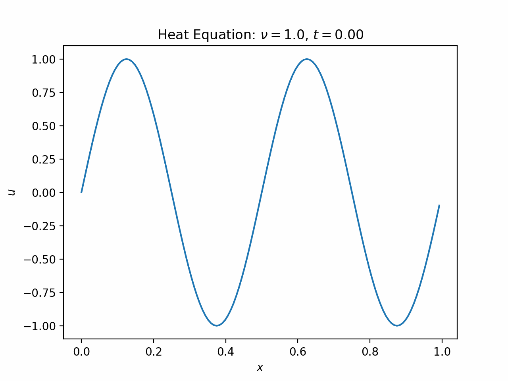
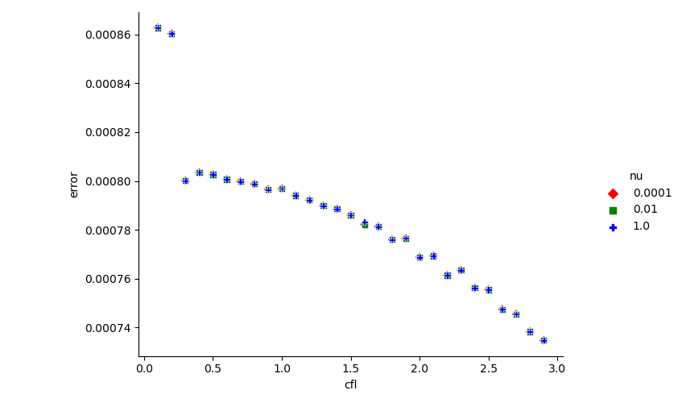

# Project 1a: Heat Equation via Crank-Nicolson

## Overview

The main function is in `src/project1a.cc`.

### Bash Scripts

- `scripts/build.sh` builds the source code. It takes definable parameters as arguments.
- `scripts/run.sh` runs the simulation, once it is built. Afterwards, a csv file containing the run data should appear.
- `scripts/build_and_run.sh` combines the two previous scripts.
- `scripts/analyze.sh` builds, runs, and finds the stability of _many_ different parameter combinations. Afterwards, a csv file containing the results should appear.

### Python Scripts

- `python/find_damping_rate.py` calculates the theoretical and experimental damping rates for a given output.
- `python/plot.py` produces an animated plot of a given output. One such result is _heat.gif_.
- `python/plot_analysis.py` displays a scatterplot of the results of `scripts/analyze.sh`. One such result is *err_vs_cfl.png*.

## Damping Rates

For the table below, I calculate the theoretical damping rate `sigma_th = 16 * pi^2 * nu`.

The experimental damping rate `sigma_exp` is determined by running the simulation with `dx = 1/128` and `dt = dx^2 / nu`. Then at each point `x_j`, I fit `u(x_j, t) = u(x_j, 0) * exp(-sigma * t)`, and take `sigma_exp` to be the median of the resulting list of `sigma`s. For consistency, I only fit `u(x_j, t)` over `t` for which the system is still equilibriating. Otherwise, the duration of the simulation would affect `sigma_exp`.

| `nu`   | `dt`       | `sigma_th` | `sigma_exp` | `% error` |
| ------ | ---------- | ---------: | ----------: | --------: |
| 1      | 6.10352e-5 |  1.5791e+2 |   1.5778e+2 |    0.085% |
| 0.01   | 6.10352e-3 |  1.5791e00 |   1.5778e00 |    0.085% |
| 0.0001 | 6.10352e-1 |  1.5791e-2 |   1.5778e-2 |    0.085% |

The choice of `dt` apparently removes the impact that `nu` has on stability (which makes sense, considering the integration scheme). Repeating the same procedure but keeping `dt=6.10352e-3` yields

| `nu`   | `dt`       | `sigma_th` | `sigma_exp` | `% error` |
| ------ | ---------- | ---------: | ----------: | --------: |
| 1      | 6.10352e-3 |  1.5791e+2 |   1.7011e+2 |    7.117% |
| 0.01   | 6.10352e-3 |  1.5791e00 |   1.5778e00 |    0.085% |
| 0.0001 | 6.10352e-3 |  1.5791e-2 |   1.5778e-2 |    0.086% |

It seems that when `dt` is excessively small, roundoff error dominates truncation error and becomes problematic.

## Other Results

## heat.gif

This is a sample gif of the time evolution of the heat equation. This run used all default parameters; in particular, `nx=128` and `dt=dx^2/nu`. All runs looked like this, just sped up or slowed down.

## err_vs_cfl.png

This is a scatterplot of relative error versus "cfl." For the purposes of Project 1a, `cfl` is simply `dt * nu / dx^2`, and it can be used to calculate `dt` instead of setting `dt` directly. The takeaway of this plot is that `cfl` can be fixed and `nu` varied without changing the outcome.

Note that while the relative error is approaching 0, it is not _converging_ to 0. Sufficiently high `cfl` values cause the relative error to bounce back up and eventually explode.

