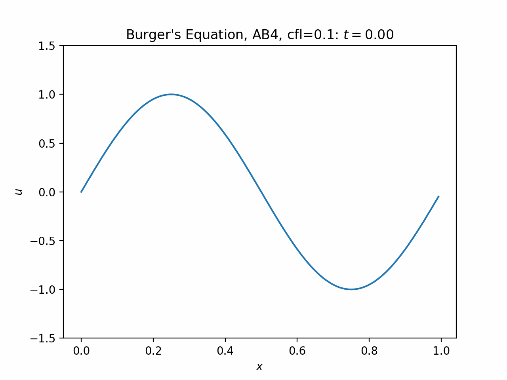
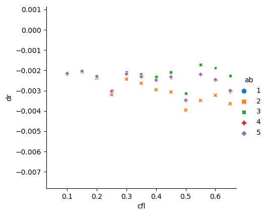

# Project 1b: Burger's Equation via Adams-Bashforth

## Overview

The main function is in `src/project1c.cc`.

### Bash Scripts

- `scripts/build.sh` builds the source code. It takes definable parameters as arguments.
- `scripts/run.sh` runs the simulation, once it is built. Afterwards, a csv file containing the run data should appear.
- `scripts/build_and_run.sh` combines the two previous scripts.
- `scripts/analyze.sh` builds, runs, and finds the stability of _many_ different parameter combinations. Afterwards, a csv file containing the results should appear.

### Python Scripts

- `python/find_stability.py` calculates the artificial damping rate for a given output.
- `python/plot.py` produces an animated plot of a given output. One such result is *wave.gif*.
- `python/plot_analysis.py` displays a scatterplot of the results of `scripts/analyze.sh`. One such result is *dr_vs_cfl.png*.

## Stability

To measure stability, I fit wave amplitude `A(t) = 1/2 * [max(u(x, t)) - min(u(x, t))]` to `A(t) = A(0) * exp(-sigma*t)` to find the artificial damping rate, `sigma`. If a run is unstable, it will have a negative damping rate and eventually explode; in such cases, I only fit A(t) on a region where the amplitude is still reasonably finite.

For some reason, Adams-Bashforth 2 is more stable than Adams-Bashforth 4 (see the scatterplots below). If I made a mistake---and I assume did---I cannot find it.

## burger.gif

This is a sample gif of the time evolution of the inviscid Burger's equation. This run used all default parameters; in particular, `which_AB=4`, `nx=128`, and `dt=0.1*dx`.

## dr_vs_cfl.png

This is a scatterplot of damping rate versus the Courant number when c=1: `cfl = dt / dx`, which can be used to calculate `dt` instead of setting `dt` directly. In all these runs, `dx=1/128`.

All of these runs managed to reach the shock formation without very much artificial damping or growth (except AB1, which rapidly exploded). In these runs, AB3 performs the best, then AB4/5, AB2, and AB1 the worst.

