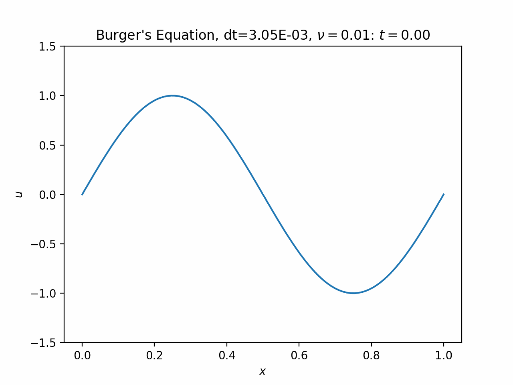
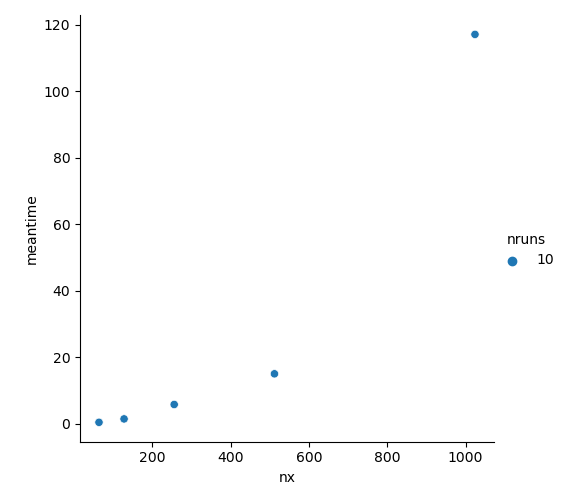

# Project 2b: Burger's Equation via CGL

## Overview

The main function is in `src/project2b.cc`.

### Bash Scripts

- `scripts/build.sh` builds the source code. It takes definable parameters as arguments.
- `scripts/run.sh` runs the simulation, once it is built. Afterwards, a csv file containing the run data should appear.
- `scripts/build_and_run.sh` combines the two previous scripts.
- `scripts/test_speed.sh` builds, runs, and finds the mean execution time (over 10 runs) of several values of `nx`.

### Python Scripts

- `python/plot_out.py` produces an animated plot of a given output. One such result is *burger_cgl.gif*.
- `python/plot_results.py` displays a scatterplot of the results of `scripts/test_speed.sh`. One such result is *scaling_cgl.png*.

## Run Output

Low-diffusivity is the most interesting, because a shock begins to form before being dissipated. Below is an example with all default parameters.

## Scaling

The scaling should be `O(nx^2)` due to the full matrix-vector multiplications. It looks like that may well be the case. In the image below, `meantime` is the average time per run, measured in seconds, and `nx` is the number of spatial gridpoints.

