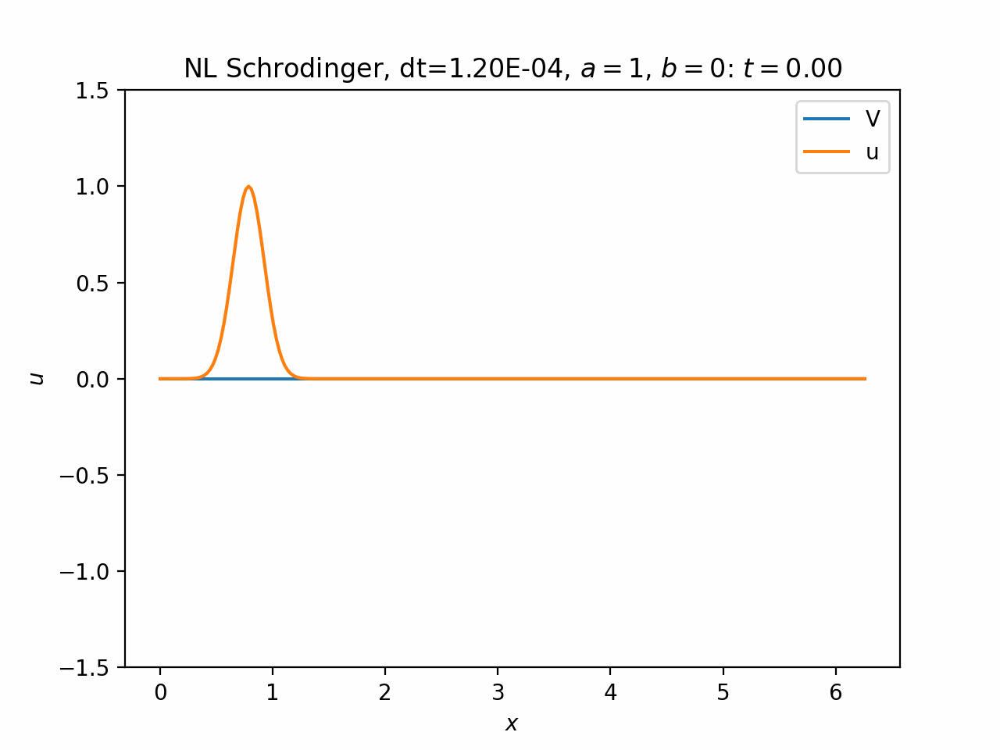
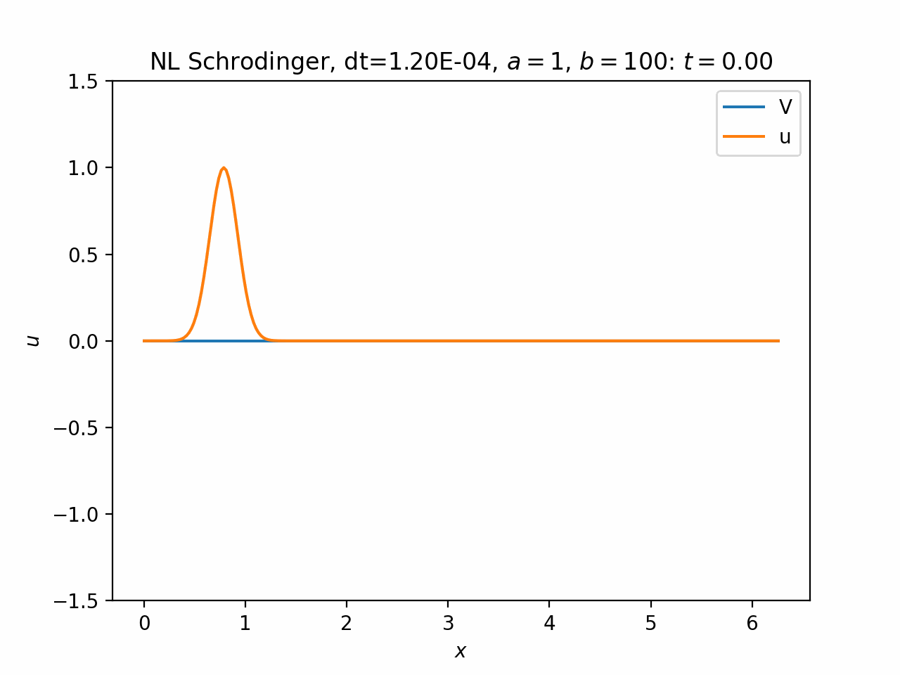
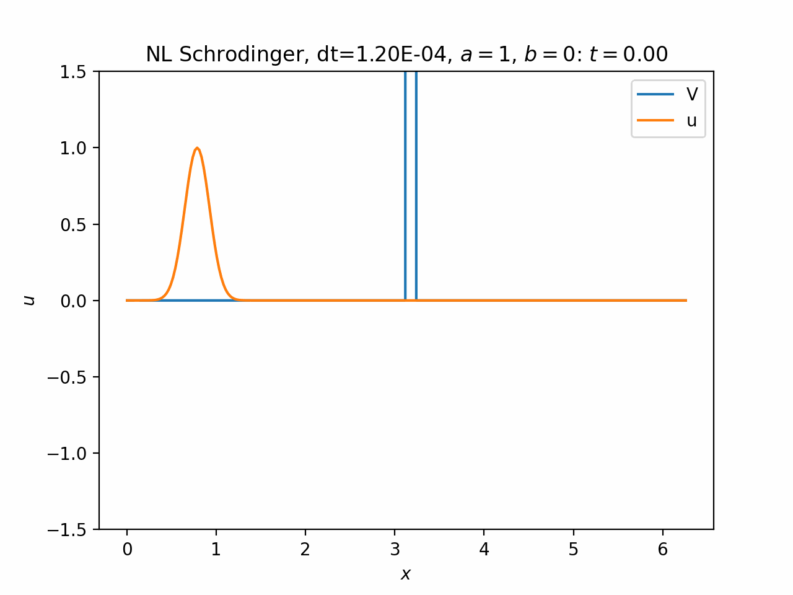
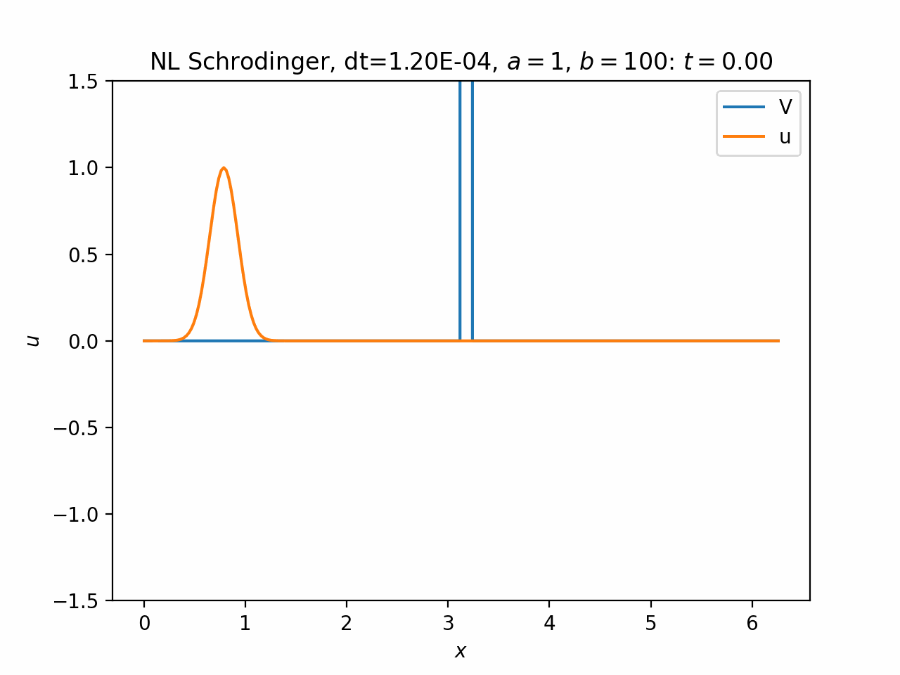

# Project 3

_by James McClung_

## Overview

For this project, I simulated a nonlinear variation of Schrodinger's equation, `u_t = i*a*u_xx + i*b*|u|^2*u - i*V*u`, where `u=u(x,t)` is complex-valued, `a` and `b` are real, and `V=V(x)` is real-valued.

The domain was from 0 to 2pi (but could be reconfigured) with periodic boundary conditions. I used the Fourier-Galerkin method. I integrated the (linear) kinetic term `i*a*u_xx` using Crank-Nicolsen (aka Adams-Moulton 1 step), and the nonlinear + potential terms `i*b*|u|^2*u - i*V*u` using Adams-Bashforth 2-step.

I ran several different cases with the goal of spotting the effects of the nonlinear term. Before each gif is the command used to produce the run. See the table below for a copy of the default parameters at the time of this writing.

### Default Parameters
| Name        | Default Value | Description                                       |
| :---------- | :------------ | :------------------------------------------------ |
| a           | 1             | Coefficient of kinetic term                       |
| b           | 1             | Coefficient of nonlinear term                     |
| nx          | 256           | Number of spatial gridpoints                      |
| nt          | 2048          | Number of time steps to run                       |
| min_x       | 0             | Lower bound for spatial domain (inclusive)        |
| max_x       | 2pi           | Upper bound for spatial domain (exclusive)        |
| dt          | dx^2/5        | Time between time steps                           |
| IC          | "packet"      | Initial conditions: either wave, gauss, or packet |
| k           | 16            | Wave number (if applicable)                       |
| potential   | "none"        | Shape of potential: either none, wall, or cos     |
| V0          | 500           | Amplitude of potential (if applicable)            |
| out_mode    | "mag2"        | How to output u: either real, imag, or mag2       |
| write_every | 8             | Number of time steps per write                    |
| out_file    | "out.csv"     | File name of output                               |

## Case 1: Infinite Plane Wave

Here is the case of the solution `u(x,t) = exp(i*k*x - i*omega*t)` for some `omega`. I show the real part because the square-magnitude is constant. The nonlinear term acts as a constant potential, slightly changing the wave speed but nothing more.

`./scripts/build_and_run.sh out_mode=real ic=wave b=0`

`./scripts/build_and_run.sh out_mode=real ic=wave b=100`

## Case 2: Wave Packet in Vacuum

This case confines a plane wave within a Gaussian envelope. In the linear case, the packet widens as it travels, as expected. In the nonlinear case, this does not happen. In fact, the packet narrows at first and later oscillate about an equilibrium. Perhaps this can be thought of as the particle moving in a potential well that moves with it, keeping it from delocalizing.

`./scripts/build_and_run.sh out_mode=mag2 ic=packet b=0`

`./scripts/build_and_run.sh out_mode=mag2 ic=packet b=100`

## Case 3.1: Wave Packet and Wall, k=8

Here is a wave packet incident on a potential wall. The wavenumber is low, so the particle is essentially not going fast enough to tunnel through the barrier. It reflects instead.

`./scripts/build_and_run.sh out_mode=mag2 ic=packet b=0 potential=wall k=8`

`./scripts/build_and_run.sh out_mode=mag2 ic=packet b=100 potential=wall k=8`

## Case 3.2: Wave Packet and Wall, k=32

Now with more energy, the particle can partially bypass through the barrier. 

`./scripts/build_and_run.sh out_mode=mag2 ic=packet b=0 potential=wall k=32`

`./scripts/build_and_run.sh out_mode=mag2 ic=packet b=100 potential=wall k=32`

## Other Cases

I ran several other cases, such as potential wells and a cosine potential, but they didn't show anything new or interesting. (A well can be made by choosing `potential=wall` and setting V0 to be negative.)